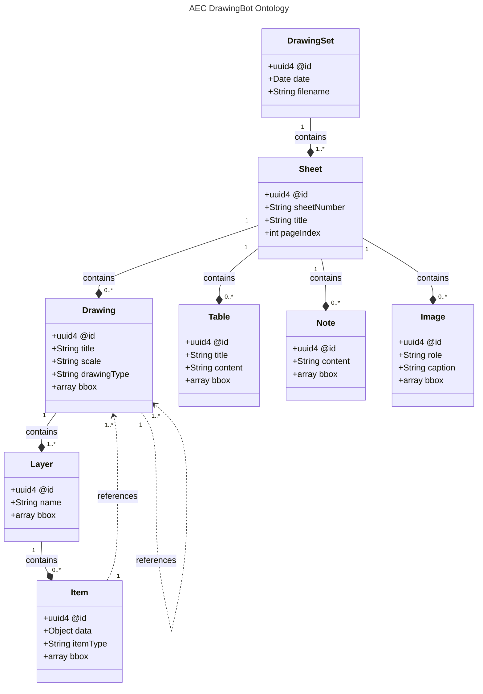

# AECDO — AEC Drawing Ontology

An open schema and CLI for structured data extracted from Architecture, Engineering, and Construction (AEC) drawings.

## What is this?

AEC projects produce hundreds of drawing sheets — floor plans, sections, details, schedules. Tools like [AEC DrawingBot](https://aecdrawingbot.com) use AI to extract structured data from these drawings into machine-readable JSON-LD files.

**AECDO** provides:

1. **An ontology/schema** defining the standard format for extracted drawing data
2. **A CLI tool** for validating, summarizing, exploring, and processing these files — including direct integration with the [DrawingBot API](https://aecdrawingbot.com/api)
3. **A [Claude Code skill](.claude/skills/aecdo/SKILL.md)** for AI agents to work with drawing data programmatically

## Quick Start

### Install

> **Coming soon:** `npm install -g aecdo` — the package will be published to npm as the primary installation method. For now, install from source:

```bash
git clone https://github.com/jeff-carmichael/aecdo.git
cd aecdo
npm install
```

### Process a PDF via the DrawingBot API

```bash
npx aecdo configure                          # one-time setup: enter API credentials and region
npx aecdo process plans.pdf                  # upload, wait for processing, download result
npx aecdo process plans.pdf --then summary   # process and immediately summarize
npx aecdo process plans.pdf -o result.jsonld # save result to a file
```

Or use the individual commands for scripting:

```bash
npx aecdo upload plans.pdf                   # returns a job ID
npx aecdo status <jobId> --wait              # poll until processing completes
npx aecdo download <jobId> -o result.jsonld  # download the JSON-LD result
```

### Validate a file

```bash
npx aecdo validate examples/sample-drawing-set.jsonld
# ✓ sample-drawing-set.jsonld is valid against AECDO schema.
```

### Summarize

```bash
npx aecdo summary examples/sample-drawing-set.jsonld
```

### List sheets or print one sheet (agent-friendly, non-interactive)

```bash
npx aecdo sheets examples/sample-drawing-set.jsonld --format json
npx aecdo page examples/sample-drawing-set.jsonld A101
npx aecdo page examples/sample-drawing-set.jsonld 0 --format json
```

`sheets` lists every sheet (number, title, page index). `page` prints one sheet selected by sheet number or page index. Both support `--format json` for scripting and LLM agents.

### Explore interactively (humans)

```bash
npx aecdo explore examples/sample-drawing-set.jsonld
```

Loads the file once, validates it, shows the sheet overview, then drops into an interactive prompt. Type a sheet number (e.g. `A101`) or page index (e.g. `0`) to see everything on that sheet — drawings, layers, items with their data and references, tables, and notes.

When stdin is not a TTY or `--format json` is passed, `explore` falls back to listing sheets so pipelines and agents don't hang on the prompt.


```
✓ sample-drawing-set.jsonld is valid against AECDO schema.

  A101 - Ground Floor Plan (page 0)
  A201 - Building Sections (page 1)

Enter a sheet number or page index to view its contents.
Type "list" to show sheets again, or "quit" to exit.

sheet> A101

════════════════════════════════════════════════════════════
  Sheet A101 — Ground Floor Plan (page 0)
════════════════════════════════════════════════════════════

  Drawing: Ground Floor Plan [plan, 1/4" = 1'-0"]
    id:   urn:uuid:22222222-2222-2222-2222-222222222222
    bbox: [72, 108, 720, 540]
    → Section A (A201, page 1)

    Layer: Walls (1 items)
      bbox: [85, 120, 700, 520]

      [THING] Exterior Wall
        id:   urn:uuid:44444444-4444-4444-4444-444444444444
        bbox: [85, 120, 700, 130]
        data:
          material: CMU 8"
          thickness: 8

    Layer: Annotations (1 items)

      [TAG] Section Cut A
        id:   urn:uuid:88888888-8888-8888-8888-888888888888
        bbox: [400, 300, 420, 320]
        data:
          referenceId: A/A201
        → Section A (A201, page 1)

  Tables (1):

    Door Schedule
      id: urn:uuid:99999999-9999-9999-9999-999999999999
      bbox: [72, 560, 400, 680]
      ┌──────────────────────────────────────────────────┐
      │ Mark | Width | Height | Type | Hardware          │
      │ D101 | 3'-0" | 7'-0" | Single | Lever            │
      └──────────────────────────────────────────────────┘

  Notes (1):

    Note: urn:uuid:bbbbbbbb-bbbb-bbbb-bbbb-bbbbbbbbbbbb
      bbox: [420, 560, 720, 650]
      1. All dimensions are to face of finish unless noted otherwise.
      2. Verify all dimensions in field prior to fabrication.

sheet>
```

## Schema Overview

The schema is at **v0.2.0** (pre-release). Full definition: [`ontology/v0.2.0/aecdo.schema.json`](ontology/v0.2.0/aecdo.schema.json)

### Hierarchy

> The diagram source is at [`ontology/v0.2.0/diagram.mmd`](ontology/v0.2.0/diagram.mmd)



### Types

| Type | Description |
|------|-------------|
| **DrawingSet** | Root — source filename, processed date, and sheets |
| **Sheet** | A page from the PDF with sheet number, title, and page index |
| **Drawing** | A view on a sheet (plan, section, elevation, detail) with scale and layers |
| **Layer** | Groups related items (e.g. "Walls", "Doors & Windows", "Annotations") |
| **Item** | An extracted entity — `thing` (physical element), `tag` (annotation/symbol), or `area` (region) |
| **Table** | A schedule or table with pipe-delimited content |
| **Note** | A general notes text block |
| **Image** | A raster image embedded on a sheet — records `role` (`logo`, `photo`, `detail-raster`, `diagram`, `other`), optional `caption`, and `bbox`. Image bytes are not stored. |

### Example

```json
{
  "@context": "https://aecdrawingbot.com/ontology/v0.2.0/aecdo#",
  "@id": "urn:uuid:a1b2c3d4-e5f6-7890-abcd-ef1234567890",
  "@type": "DrawingSet",
  "processedDate": "2026-04-10T14:30:00Z",
  "filename": "Example_Building_Plans.pdf",
  "sheets": [
    {
      "@id": "urn:uuid:11111111-1111-1111-1111-111111111111",
      "@type": "Sheet",
      "sheetNumber": "A101",
      "title": "Ground Floor Plan",
      "pageIndex": 0,
      "drawings": [
        {
          "@id": "urn:uuid:22222222-2222-2222-2222-222222222222",
          "@type": "Drawing",
          "title": "Ground Floor Plan",
          "drawingType": "plan",
          "bbox": [72, 108, 720, 540],
          "layers": [
            {
              "@id": "urn:uuid:33333333-3333-3333-3333-333333333333",
              "@type": "Layer",
              "name": "Walls",
              "items": [
                {
                  "@id": "urn:uuid:44444444-4444-4444-4444-444444444444",
                  "@type": "Item",
                  "itemType": "thing",
                  "data": { "label": "Exterior Wall", "material": "CMU 8\"" },
                  "bbox": [85, 120, 700, 130]
                }
              ]
            }
          ]
        }
      ]
    }
  ]
}
```

## Project Structure

```
package.json            npm package root (publishes as "aecdo")
ontology/               Schema definitions (versioned)
  v0.2.0/
    aecdo.schema.json     JSON Schema for validation
    context.jsonld         JSON-LD context for linked data
    diagram.mmd            Mermaid class diagram of the ontology
cli/                    CLI tool (TypeScript, compiled to dist/)
  bin/aecdo.ts            Entry point (npx aecdo)
  src/commands/           validate, summary, explore, configure, upload, status, download, process
  src/lib/                Schema loading, output utilities, API client, auth, config
examples/               Sample JSON-LD files
.claude/skills/aecdo/   Claude Code skill (auto-installed by postinstall)
CONTRIBUTING.md         How to contribute (especially schema changes)
CHANGELOG.md            Version history
```

## For AI Agents

Installing the CLI (`npm install -g aecdo`) automatically copies the Claude Code skill to `~/.claude/skills/aecdo/SKILL.md`. This lets Claude Code use the `aecdo` commands directly when working with drawing data.

## Contributing

See [CONTRIBUTING.md](CONTRIBUTING.md). Schema changes go through an issue-first process to maintain compatibility. The schema uses semantic versioning.

## Relationship to AEC DrawingBot

[AEC DrawingBot](https://aecdrawingbot.com) is the primary producer of AECDO-conformant files. The DrawingBot website will serve the schema directly from this repository. However, AECDO is an open standard — any tool can produce or consume conforming files.

## License

Apache License 2.0 — see [LICENSE](LICENSE).
